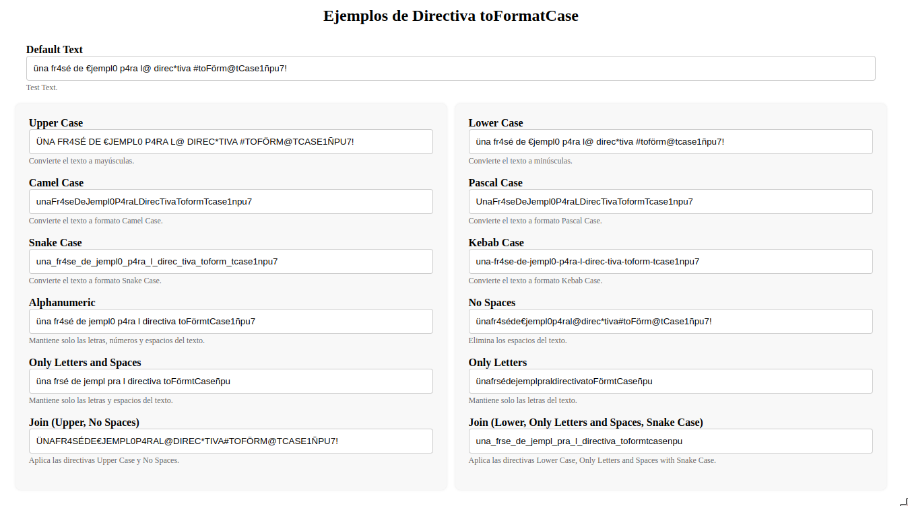

# Angular Format Case Directive

La directiva `toFormatCase` es una herramienta útil para formatear el texto ingresado en campos de entrada en una aplicación Angular. Permite convertir el texto en diferentes estilos de formato, como mayúsculas, minúsculas, camelCase, snake_case, entre otros.

## Uso

1. Importa la directiva en tu módulo Angular:

```typescript
import { NgModule } from '@angular/core';
import { BrowserModule } from '@angular/platform-browser';
import { FormatCaseInputDirective } from 'angular-format-case-directive';

@NgModule({
  declarations: [
    // Otros componentes y directivas
    FormatCaseInputDirective
  ],
  imports: [
    BrowserModule,
    // Otros módulos importados
  ],
  providers: [],
  bootstrap: [AppComponent]
})
export class AppModule { }
```

2. Aplica la directiva en tus campos de entrada en tus plantillas HTML:

```html
<input type="text" toFormatCase="upper" placeholder="Ingrese texto en mayúsculas">
```

## Parámetros de la Directiva

La directiva `toFormatCase` acepta los siguientes parámetros:

- `toFormatCase`: Especifica el tipo de formato al que se debe convertir el texto. Puede ser 'upper', 'lower', 'camel', 'snake', entre otros.
- `ignoredCharacters`: Opcional. Especifica los caracteres que se deben ignorar al formatear el texto.
- `joinedFormats`: **Deprecado** - Opcional. Especifica los formatos que se deben aplicar al texto ingresado. Solo se usa cuando el valor de `toFormatCase` es 'join'.
- `onlyNumberParams`: Opcional. Un objeto que define configuraciones específicas cuando toFormatCase es 'onlynumbers'. Incluye:
  - maxDecimals: Máximo número de decimales permitidos.
  - minValue: Valor mínimo permitido.
  - maxValue: Valor máximo permitido.
- `customRegex`: Opcional. Expresión regular personalizada que permite eliminar caracteres específicos del texto.
## Valores de `toFormatCase`

- **Por defecto**: `toFormatCase="default"`
- **Mayúsculas**: `toFormatCase="upper"`
- **Minúsculas**: `toFormatCase="lower"`
- **CamelCase**: `toFormatCase="camel"`
- **PascalCase**: `toFormatCase="pascal"`
- **SnakeCase**: `toFormatCase="snake"`
- **Sin espacios**: `toFormatCase="nospaces"`
- **Alfanumérico**: `toFormatCase="alphanumeric"`
- **Solo letras**: `toFormatCase="onlyletters"`
- **Solo letras y espacios**: `toFormatCase="onlylettersandspaces"`
- **KebabCase**: `toFormatCase="kebab"`
- **Join**: `toFormatCase="join"`
- **Solo números**: `toFormatCase="onlynumbers"`
- **Expresión regular personalizada**: `toFormatCase="customregex"` **(En progreso)**

### Ejemplo con onlynumbers y customregex

```html
<!-- Campo de texto que solo acepta números con un máximo de 2 decimales -->
<input type="text" toFormatCase="onlynumbers" [onlyNumberParams]="{ maxDecimals: 2, minValue: 0, maxValue: 100 }" />

<!-- Campo de texto que elimina caracteres según una expresión regular personalizada -->
<input type="text" toFormatCase="customregex" [customRegex]="[^a-zA-Z0-9]" />
```

### Format Join

El valor `join` de la directiva `toFormatCase` permite unir la aplicación de varios formatos en un solo campo de entrada. Para ello, se deben especificar los formatos a aplicar separados por coma (`,`). Por ejemplo, para aplicar los formatos `upper` y `snake` al texto ingresado, se debe usar el valor `join` de la siguiente manera:

```html
<input type="text" toFormatCase="join" joinedFormats="upper,snake" />
```

## Casos donde se puede aplicar la directiva

- input normal
- input con ngModel
- input dentro de formularios reactivos (formControl)

## Ejemplos

Puedes encontrar ejemplos de cómo usar esta directiva en la carpeta `src/examples` de este repositorio.



## Contribuciones

Las contribuciones son bienvenidas. Si encuentras algún problema o tienes una idea para mejorar la directiva, no dudes en abrir un issue o enviar un pull request.